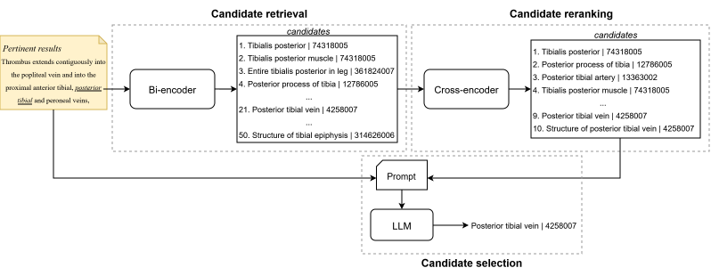

# LLMs for the Unknown: Generalizing Clinical Entity Linking to Unseen Mentions and Concepts

This repository contains our approach to perform medical entity linking, focusing on unseen mentions and unseen concepts. Our proposed method follows a four step pipeline:

1. Disambiguation abbreviation.
2. Bi-encoder candidate retrieval.
3. Cross-encoder candidate reranking.
4. LLM-based candidate selection.



## Train bi-encoder and cross-encoder from the article

Our approach, as described in the paper, uses a trained bi-encoder and trained cross-encoder following the methodology described by [ClinLinker-KB](https://github.com/ICB-UMA/ClinLinker-KB).

### Triplet generation 

Follow the steps described in their [repository](https://github.com/ICB-UMA/ClinLinker-KB), as there is one script for [triplet definition](https://github.com/ICB-UMA/ClinLinker-KB/blob/master/notebooks/triplets_definition.ipynb).

### Bi-encoder training

To train your bi-encoder using the new triplets generated, follow the steps described in [SapBERT's repository](https://github.com/cambridgeltl/sapbert).

### Cross-encoder training

Once you have your bi-encoder ready, you can use the script prepared for [training the cross-encoder](https://github.com/ICB-UMA/ClinLinker-KB/blob/master/scripts/cross_encoder_training.py) from [ClinLinker's repository](https://github.com/ICB-UMA/ClinLinker-KB).

## Generate embeddings for SNOMED CT concepts

### Prepare SNOMED CT files

Download the RF2 files of the international edition of SNOMED CT from [NIH](https://www.nlm.nih.gov/healthit/snomedct/international.html).

The SNOMED CT files can be prepared in the *snomed_data* folder by using the following script:
```
python create_snomed_data.py <path_to_snomed_ct_international_rf2_folder>
```

If you want to include Spanish description's for SNOMED CT concepts, the Spanish edition can be downloaded from the web of the [SNOMED CT Spanish's Ministry of Health](https://snomed-ct.sanidad.gob.es/snomed-ct/solicitudLicencia.do). To use the Spanish version, the international edition is also required. The files can be prepared by using:
```{python}
python create_snomed_data.py <path_to_snomed_ct_international_rf2_folder> <path_to_snomed_ct_spanish_rf2_folder>
```

### Download datasets

The SNOMED CT Entity Linking Challenge can be downloaded from their [PhysioNet page](https://physionet.org/content/snomed-ct-entity-challenge/1.2.1/).

The Spanish datasets can be accessed from their corresponding shared task homepages: [DisTEMIST](https://temu.bsc.es/distemist/), [SympTEMIST](https://temu.bsc.es/symptemist/), and [MedProcNER](https://temu.bsc.es/medprocner/).

### Create the SNOMED CT embedding's dictionary/database

To create the SNOMED CT embeddings file for the training concepts in *snomed_dictionaries*, run the following script:
```
python create_sct_dictionary.py <model_name> <triplet_type> <dataset>
```

The arguments for the script are <model_name>, which is the name of the bi-encoder (in our paper that is *pubmed*, *sapbert*, or *roberta*); <triplet_type>, which is the triplet configuration used to train the bi-encoder and cross-encoder (in our paper: *grandparents*, *parents*, or *noparents*); and <dataset>, which is the name of the dataset, so that only concepts from the gazzeteer are used (*distemist*, *symptemist*, *medprocner*, or *snomed*).

> [!NOTE]
> This script and the others are prepared considering that all embedding related files follow certain naming conventions. More information about that or how to change them can be read in their corresponding folders: embeddings dictionaries in the folder [snomed_dictionaries](snomed_dictionaries/README.md), bi-encoders in the [sentence_bert_models](sentence_bert_models/README.md) folder, and about cross-encoders in [cross-encoder](cross-encoder/README.md).

## Obtain predictions for the datasets

### Predictions for SNOMED CT Entity Linking Challenge

To obtain the predictions for the SNOMED CT Entity Linking Challenge you need:
- An embedding model in *sentence_bert_models/*.
- Its corresponding embedding dictionary in *snomed_dictionaries/*.
- A cross-encoder in *cross-encoder/*.
- SNOMED CT files in *snomed_data/*.
- The SNOMED CT Entity Linking Challenge dataset (MIMIC-IV annotations and notes) in *mimic_data/*.
- Config files in *src/config_files/*: one with the API_KEY and ENDPOINT for Azure, and another one with the parameters for the pipeline (see [example](src/config_files/config_run.cfg)).

To obtain the predictions, run the following script:
```
python predict_snomed.py <path_to_config_run_parameters> <model_name> <triplet_type>
```

This generates a file with all the predictions and a file with predictions per clinical note in the folder *el_checkpoints/* according to the *execution_name* from the configuration file. 

Using the file with all the predictions, you can obtain the accuracy results per pipeline stage and per subdataset (*unseen mentions* and *unseen codes*) using the following script:
```
python evaluate_snomed.py <path_to_the_predictions_file>
```

### Predictions for DisTEMIST, SympTEMIST, and MedProcNER

To obtain the predictions for DisTEMIST, SympTEMIST, and MedProcNER you need:
- An embedding model in *sentence_bert_models/*.
- Its corresponding embedding dictionary in *snomed_dictionaries/*.
- A cross-encoder in *cross-encoder/*.
- International and Spanish SNOMED CT files in *snomed_data/*.
- The corresponding dataset folder in *temist/* with its name in lowercase.
- Config files in *src/config_files/*: one with the API_KEY and ENDPOINT for Azure, and another one with the parameters for the pipeline (see [example](src/config_files/config_run.cfg)).

To obtain the predictions, run the following script:
```
python predict_temist.py <path_to_config_run_parameters> <dataset> <model_name> <triplet_type>
```

This generates a folder similar to the predictions for the SNOMED CT Entity Linking Challenge.

Using the file with all the predictions, you can obtain the accuracy results per pipeline stage and per subdataset (*unseen mentions* and *unseen codes*) using the following script:
```
python evaluate_temist.py <path_to_the_predictions_file>
```

